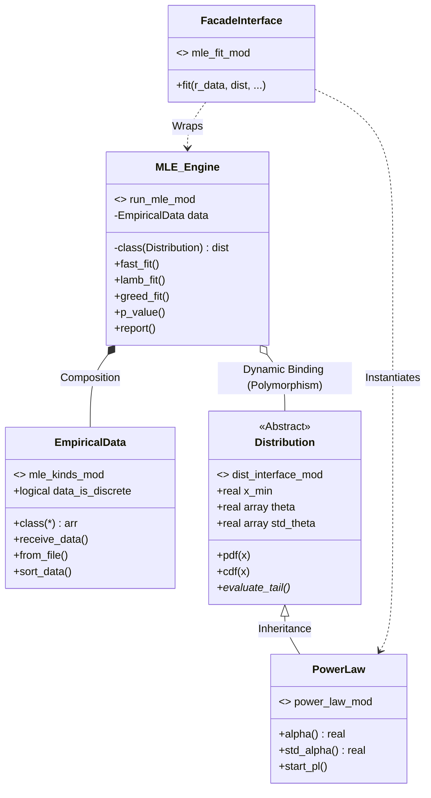

# mle_fit 📈

[](https://www.gnu.org/licenses/old-licenses/gpl-2.0.en.html)
[](https://fpm.fortran-lang.org/)

**High-Performance Modern Fortran Library for Empirical Distributions Fitting**

This project implements robust and optimized Maximum Likelihood Estimation (MLE) methods for fitting heavy-tailed and probability distributions to empirical data. It builds upon the theoretical framework for power-laws by [Clauset, Shalizi, and Newman (2009)](http://arxiv.org/abs/0706.1062), solving critical theoretical limitations (such as the local minima problem) while delivering massive performance gains.

Originally focused on Python-Fortran integration as part of the thesis [*Complexidade e Emergência em Linguagens Naturais*](https://drive.google.com/file/d/1VF6BgdaVsb-DG5UdC0VnKhsgc-dNbC1J/view?usp=sharing) at the Federal University of Viçosa (UFV), Brazil. Now, it has been completely rewritten in **Modern Fortran (OOP)** to leverage SIMD vectorization, multi-threading, and advanced algorithmic optimizations.

Contributions are welcome! Please feel free to collaborate.

## 🚀 Quick Start

To use `mle_fit`, simply import the library's **facade interface**. Fitting a dataset and calculating the p-value becomes as simple as one line of code:

```fortran
program main
    
    !> Import module interface
    use mle_fit_mod
    implicit none
    
    !> Declare variables
    real(8) :: alpha_res, pval_res
    
    !> Load your empirical data
    class(*) :: my_data_arr(:)    ! <-- Can be either integer or real data; currently doesn't support quad real type

    !> Fit the distribution with the fit subroutine
    call fit( r_data = my_data_arr, &   ! <-- Raw data
              dist = power_law(), &     ! <-- Pass the power_law interface
              alpha = alpha_res, &      ! <-- Save alpha parameter
              run_pvalue = .true., &    ! <-- Run goodness_of_fit routine
              p_value = pval_res )      ! <-- Save p_value parameter
              
    print *, "Fitted Alpha: ", alpha_res
    print *, "P-value: ", pval_res

end program main
```

*(Note: For advanced usage, see the # Manual topic).*

## 📦 Installation

To use `mle_fit` in your Fortran project, simply add it as a dependency in your `fpm.toml` file:

```toml
[dependencies]
mle_fit = { git = "https://github.com/timotheosf/mle_fit.git" }
```

> **Note:** To leverage the OpenMP parallel processing for p-value generation, ensure your compiler supports it and add the appropriate flag (e.g., `-fopenmp` for GCC) in your build command or `fpm.toml` compiler options.

Build your project using the release profile for maximum optimization:
```bash
fpm build --profile release --compiler gfortran --flag "-O3 -fopenmp"
```

## ✨ Key Features & Innovations

* **Extreme Performance:** Implements an $\mathcal{O}(1)$ dynamic cumulative parameter calculation and a vectorized Kolmogorov-Smirnov (KS) statistic evaluation. Benchmarks show `mle_fit` is **~300x faster for integer data and up to ~10,000x faster for real data** compared to the widely used Python `powerlaw` package.
* **OpenMP Parallelization:** The computationally expensive Monte Carlo goodness-of-fit test (p-value) is fully parallelized utilizing OpenMP with thread-safe independent RNGs, reducing test times from hours to seconds.
* **Regularized Loss Functional (`lamb_fit`):** Extends the standard Clauset method by introducing a dynamic penalty ($\lambda$) that prevents the algorithm from discarding too much valid data just to artificially improve the KS-statistic.
* **Greedy Search Algorithm (`greed_fit`):** Scans the entire KS-landscape for local minima and applies dynamic thresholds, solving the overestimation of $x_{\min}$ (e.g., the *Moby Dick* dataset problem).
* **Polymorphic Architecture:** Built on a Strategy Pattern using Fortran Abstract Interfaces. The central MLE engine is completely agnostic, treating any probability distribution as a plug-and-play module.

## 🏗️ Architecture

The library is designed with strict separation of concerns. The `distribution` abstract interface makes it easy to scale for other distributions, such as `exponential` or `poisson`. The mathematical definitions of the distributions are isolated from the heavy-lifting optimization engine:

```text
src/
 ├── mle_kinds.f90        (Foundation: precision types, dynamic data arrays, timers)
 ├── dist/                (Distributions Ecosystem)
 │    ├── dist_interface.f90  (The Mold: 'distribution' abstract interface)
 │    └── power_law.f90       (Distribution: extends abstract class with O(1) math)
 ├── run_mle.f90          (The Engine: handles KS minimization and OpenMP P-values)
 └── mle_fit.f90          (The Facade: user-friendly wrappers)
```

Under the hood, `mle_fit` leverages advanced Fortran OOP capabilities. Here is the UML class diagram representing the system's architecture:




## 📖 User's Manual (Advanced Usage)

While the facade interface (`call fit()`) is perfect for quick analyses, `mle_fit` is built on a powerful Object-Oriented foundation. Accessing the underlying classes allows you to use advanced fitting strategies, handle data directly, and fine-tune your statistical models.

Here is a step-by-step guide to using the core OOP engine.

### Step 1: Handling Data (`empirical_data`)
The `empirical_data` class is a polymorphic wrapper that handles data ingestion, sorting, and type conversion seamlessly.

```fortran
use mle_kinds_mod
type(empirical_data) :: my_data

! Option A: Read directly from an opened text file
! (Automatically detects if data is integer or real and sorts it)
call my_data%from_file( file_unit = 10, skip_title = .true. )

! Option B: Load from an existing Fortran array in memory
! (Supports i1, i2, i4, i8, sp, and dp arrays)
real(dp) :: raw_array(1000)
! ... fill raw_array ...
call my_data%receive_data( raw_array )
```

### Step 2: Initializing the Distribution
Before fitting, you must instantiate and initialize the theoretical distribution you want to use. Currently, `mle_fit` natively supports the Power-Law distribution.

```fortran
use power_law_mod
type(power_law_t) :: pl

! Wake up the distribution (allocates parameter arrays)
! You can optionally pass a seed for its internal RNG
call pl%start_pl( seed=42 ) 
```

### Step 3: The MLE Engine and Fitting Strategies
The `mle_t` class is the heart of the library. It binds the data and the distribution together and performs the Kolmogorov-Smirnov (KS) minimization. You can choose between three different algorithms:

```fortran
use run_mle_mod
type(mle_t) :: engine

! Strategy 1: Standard Clauset Fit 
! Fast and standard KS minimization. Allows forcing a fixed x_min.
call engine%fast_fit( r_data = my_data%arr, dist = pl )
! call engine%fast_fit( r_data = my_data%arr, dist = pl, fixed_xmin = 10.0_dp )

! Strategy 2: Regularized Fit (Tail-Weighted)
! Penalizes the algorithm for discarding too much data (higher lambda = longer tails)
call engine%lamb_fit( r_data = my_data%arr, dist = pl, lambda_in = 0.15_dp )

! Strategy 3: Greedy Search Algorithm
! Scans the KS-landscape for local minima with statistical significance
call engine%greed_fit( r_data = my_data%arr, dist = pl, look_whole = .true. )
```
*(Note: All methods optionally accept `use_weight = .true.` to apply Anderson-Darling variance weighting to the KS-statistic).*

### Step 4: Goodness-of-Fit (P-value)
Testing the null hypothesis requires generating synthetic datasets and refitting them via Monte Carlo bootstrapping. This process is fully parallelized with **OpenMP**.

```fortran
! Generates 2500 synthetic datasets and compares the KS distances
call engine%p_value( N_samples = 2500 )
```
*Tip: A p-value $\ge 0.1$ usually indicates that the power-law is a plausible hypothesis for the data.*

### Step 5: Accessing Results and Reporting
After fitting, you can either print a formatted summary to the console or access the variables directly through the distribution object.

```fortran
! 1. Print a complete benchmark and statistical report
call engine%report()

! 2. Access variables programmatically
print *, "Best x_min found: ", pl%x_min
print *, "Calculated alpha: ", pl%alpha()
print *, "Standard dev:     ", pl%std_alpha()
print *, "Final KS Stat:    ", pl%ks
print *, "Tail Size:        ", pl%n_tail

! 3. Evaluate PDFs and CDFs using the fitted parameters
real(dp) :: prob
prob = pl%pdf( 150.0_dp )  ! Probability density at x = 150
prob = pl%cdf( 150.0_dp )  ! Cumulative density at x = 150
prob = pl%ccdf( 150.0_dp ) ! Complementary CDF (Survival function)
```

## 🗺️ Roadmap & Future Work

While the Fortran numerical core is complete and highly optimized, the following features are planned for upcoming releases:
- [ ] **Native Python Bindings via `bind(C)`:** Re-introducing Python interoperability using Fortran's `iso_c_binding` and `ctypes`. The goal is to allow Python users to `import mle_fit` and run the Fortran core directly on Numpy arrays without losing performance, bridging the gap between Data Science workflows and HPC.
- [ ] **Other Distributions:** Addition of exponential, log-normal, normal distributions, and power-law with exponential cut-off utilizing the polymorphic `dist_interface`.
- [ ] **Advanced Statistics:** Implementation of the Log-Likelihood ratio test and Vuong's closeness test to compare competing distributions.

## 📜 License & Citation

This project is licensed under the **GPLv2 License**. See the `LICENSE` file for details.

If you use `mle_fit` in your research, please consider acknowledging it. A formal paper/citation format will be provided soon.


**Acknowledgments:** The thread-safe Monte Carlo bootstrapping relies on the [rndgen-fortran](https://github.com/wcota/rndgen-fortran) library, developed by Wesley Cota, which implements the Keep-It-Simple-Stupid (KISS) RNG in an OOP paradigm.

*Built in collaboration with the [Complex Systems Investigation Group (GISC) - UFV](https://www.giscbr.org/).*